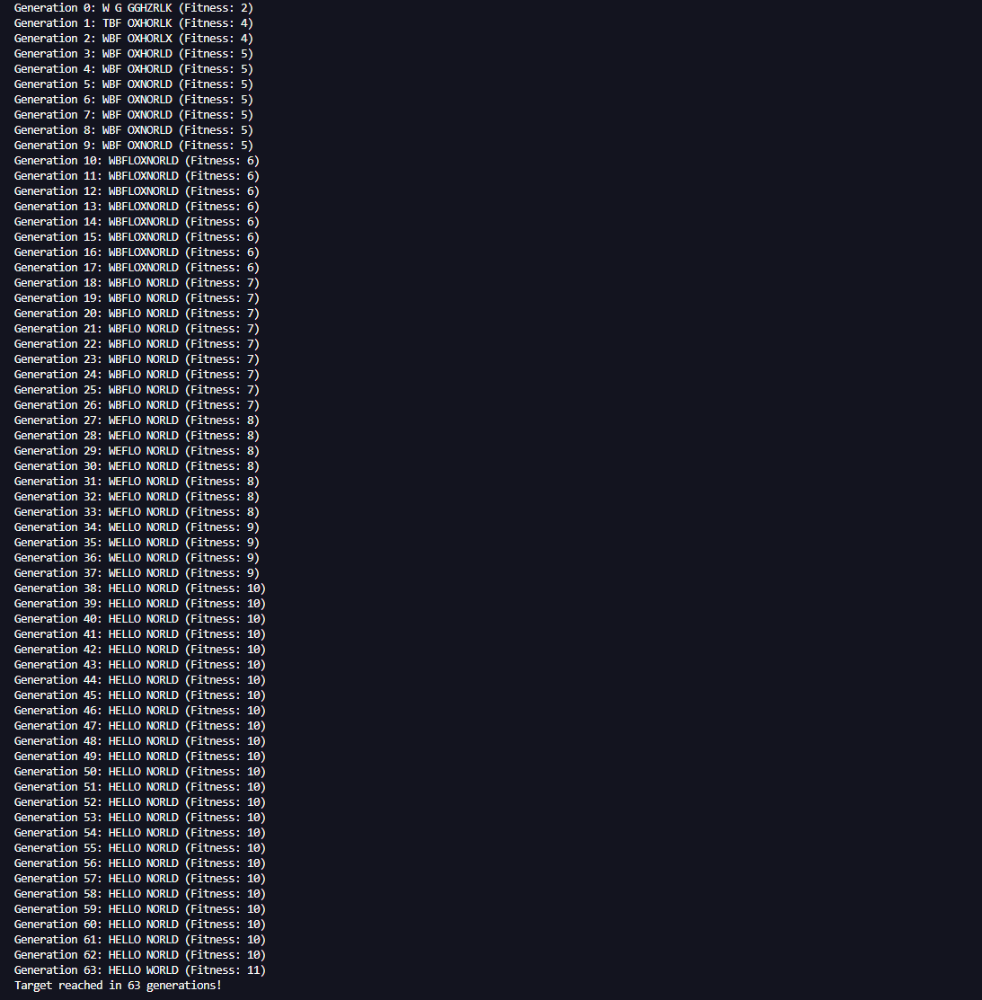

# Genetic Algorithm Project

This project implements a basic **Genetic Algorithm** in Java, demonstrating how an evolutionary process can be used to solve optimization problems. The goal of this algorithm is to evolve a population of individuals (represented by strings of characters) towards a target string, using the principles of **selection**, **crossover**, and **mutation**.

## Project Overview

This project includes the following main components:
- **GeneticAlgorithm**: The core logic of the algorithm, including fitness calculation and random string generation.
- **Population**: Manages the population of individuals, performs parent selection, crossover, and mutation.
- **Individual**: Represents a candidate solution with genes and fitness.
- **GeneticAlgorithmMain**: The main class that runs the genetic algorithm and displays results.

The target for the genetic algorithm is a specific string, and through generations, the population of individuals gets closer to this target string.

## Features

- **Selection**: The top two fittest individuals are selected for reproduction (elitism).
- **Crossover**: Two parents combine to create a new child individual.
- **Mutation**: Random changes are introduced to an individual with a specified mutation rate.

## Screenshot


## Setup

1. Clone the repository:
   ```bash
   git clone https://github.com/your-username/genetic-algorithm.git
   cd genetic-algorithm
Compile and run the project:


Example Output
Here’s an example of what the output might look like after running the program:

Generation 1: Best Solution: 'Xxxxx Xxxx'
Generation 2: Best Solution: 'Xxxxxx Xx'
Generation 3: Best Solution: 'Genetic Algorithm'
...